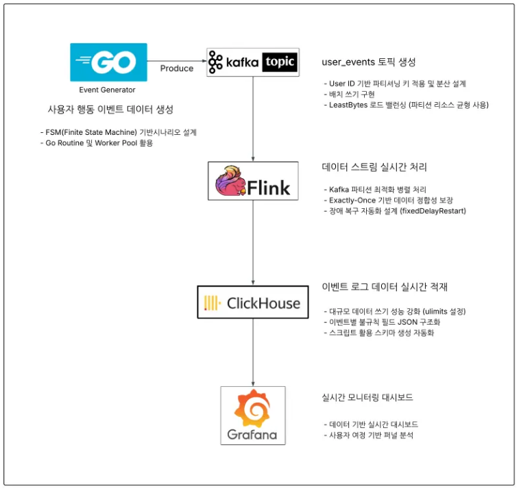

# 실시간 여행 상품 유저 여정 데이터 파이프라인

실제 여행 이커머스 환경을 가정하여  
**대규모 사용자 행동 데이터를 실시간으로 수집·처리·분석하고,  
비즈니스 의사결정을 지원하는 스트리밍 데이터 파이프라인**을 구축한 프로젝트입니다.

Go–Kafka–Flink–ClickHouse–Grafana로 이어지는  
**End-to-End 실시간 데이터 흐름을 직접 설계·구현**했습니다.

---

## 프로젝트 목적

- 여행 이커머스의 **복잡한 유저 여정(검색 → 클릭 → 구매)**을  
  단순 로그가 아닌 **State / Event 기반 실시간 스트림 데이터**로 추적
- 대규모 트래픽 상황에서도 **정합성과 지연 없는 분석 환경** 구축
- 기획·마케팅·운영 관점에서 즉시 활용 가능한 **실시간 BI 대시보드 제공**

---

## 핵심 구현 내용

### 1. 고성능 이벤트 생성 (Go)

- FSM(Finite State Machine) 기반 유저 행동 시뮬레이션
- 실제 커머스 흐름을 반영한 상태 전이 모델
- 초당 **20,000 TPS** 이벤트 안정적 생성
- UserID 기반 Kafka Key 파티셔닝으로 이벤트 순서 보장

### 2. 실시간 스트림 처리 (Kafka + Flink)

- Kafka → Flink → ClickHouse 실시간 파이프라인 구축
- Exactly-Once 처리 보장 (Checkpoint 기반 장애 복구)
- Kafka 파티션 수와 Flink 병렬도 1:1 매핑으로 처리 효율 극대화

### 3. 실시간 분석 및 시각화 (ClickHouse + Grafana)

- JSON 로그를 ClickHouse에서 실시간 파싱하여 OLAP 분석
- 유저 퍼널 전환율, 국가/카테고리/결제수단별 지표 시각화
- 시스템 처리량(EPS) 및 데이터 지연 모니터링 대시보드 구현

---

## 아키텍처 및 대시보드 이미지 

(1) 아키텍처

(2) Grafana 대시보드

---

## 기술 스택

- **Language**: Go, Java
- **Streaming**: Kafka (KRaft), Apache Flink
- **Storage**: ClickHouse (OLAP)
- **Visualization**: Grafana
- **Infra**: Docker Compose

---

## 성과

- 초당 **20,000 TPS** 실시간 이벤트 처리 성능 검증
- Exactly-Once 기반 데이터 정합성 확보
- 단순 로그가 아닌 **유저 여정 중심 분석 구조 구현**
- 여행 이커머스 도메인을 반영한 실무 지향 파이프라인 설계 경험

---

## 프로젝트 의의

해당 프로젝트를 진행하면서 접해보지 않았던 언어와 툴을 활용하여 목적한 퍼포먼스를 달성했다는데 의의가 있다고 생각합니다.
그리고 대규모 데이터 처리 경험 역시 좋은 경험이었다고 생각합니다.
다만 급하게 제작하느라 고도화가 필요한 프로젝트입니다.
앞으로 조금 더 보완해볼 생각입니다.
